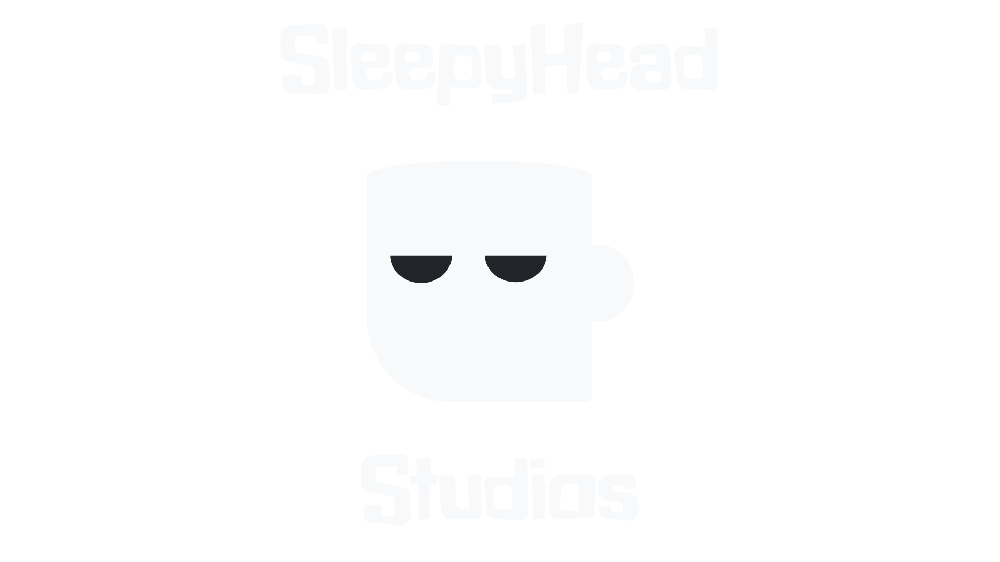

# SleepyHeads Studios - Official Website

_A dynamic, engaging, and performant official website for SleepyHead Studios._

---

## 🚀 Project Overview

This is the official website for **SleepyHead Studios**, an indie game development team passionate about crafting unique and memorable gaming experiences.. This platform serves as our digital home, showcasing our portfolio of games, sharing studio news, introducing our talented team, and providing a direct point of contact for our community and potential partners.

Built with modern web technologies, the website prioritizes performance, responsiveness, and an immersive user experience, reflecting the creative spirit of our games.

---

## ✨ Features

* **Dynamic Games Showcase:** A beautifully designed section to display our game titles with interactive flip cards and external links to platforms like Itch.io.
* **Interactive News & Updates:** A chronological timeline of studio milestones, announcements, and project updates.
* **Engaging Team Profiles:** Interactive flip cards introduce each team member, highlighting their role and linking to their professional social profiles.
* **Contact Form (Future):** A dedicated section for inquiries and community interaction.
* **Responsive Design:** Optimized for seamless viewing across all devices, from mobile phones to large desktop screens.
* **Smooth Animations:** Powered by Framer Motion for delightful and intuitive UI interactions.
* **Optimized Performance:** Leveraging Next.js for fast loading times and efficient rendering.

---

## 🛠️ Technologies Used

* **Next.js 14+ (App Router):** A React framework for building fast, full-stack web applications.
* **React 19:** The core JavaScript library for building user interfaces.
* **Tailwind CSS:** A utility-first CSS framework for rapidly building custom designs.
* **Framer Motion:** A production-ready motion library for React to power animations.
* **React Icons:** A library for popular icon packs in React projects.
* **`@studio-freight/react-lenis`:** For smooth scrolling capabilities.

---

## 🤝 Contributing

We welcome contributions! If you have suggestions for improvements or find any issues, please feel free to:

1.  Fork the repository.
2.  Create a new branch (`git checkout -b feature/your-feature-name`).
3.  Make your changes.
4.  Commit your changes (`git commit -m 'Add some feature'`).
5.  Push to the branch (`git push origin feature/your-feature-name`).
6.  Open a Pull Request.

---

## 👤 Our Team

Meet the talented individuals behind SleepyHeads Studios:

* **Rahul Kumar Mahato** - Lead Developer
* **Narayan Satapathy** - 3D Artist & UI/UX
* **Vivek Kumar** - 2D Artist
* **Ayush Sinha** - Web Developer

---

